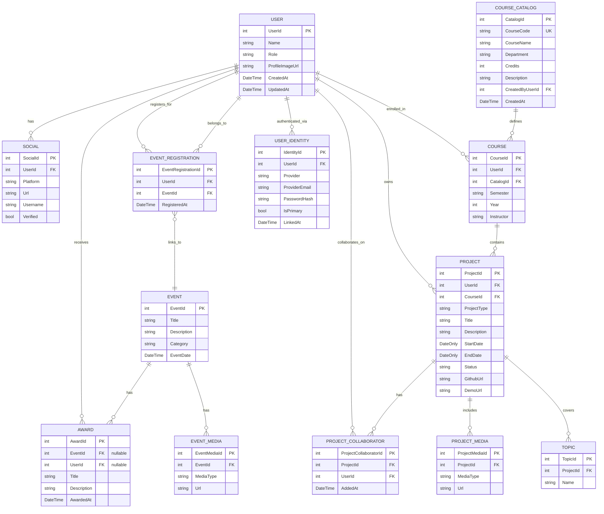

# JayWiki Database Schema
 
This Entity Relationship Diagram represents the current production database implementation as of May 2026. The schema was created with Entity Framework Core migrations and is deployed to Azure SQL Database.
 
---
 
## Visual ERD (Mermaid Diagram)
 
The following diagram renders automatically on GitHub. For VS Code preview, install the "Markdown Preview Mermaid Support" extension.
 

 
---
 
## Entities and Attributes
 
### 1. USER
- **UserId** (int, PK, Identity)
- **Name** (string, required)
- **Role** (string, required, default: "student") — "student" | "instructor" | "admin"
- **ProfileImageUrl** (string, nullable) — Azure Blob Storage URL for profile picture
- **CreatedAt** (DateTime, required)
- **UpdatedAt** (DateTime, required)
- Connected to: USER_IDENTITY, SOCIAL, COURSE, PROJECT, EVENT_REGISTRATION, PROJECT_COLLABORATOR, AWARD
- **Note:** `Email` and `AuthProvider` removed — email and provider are now stored in USER_IDENTITY to support multiple login methods per account.
### 2. USER_IDENTITY
- **IdentityId** (int, PK, Identity)
- **UserId** (int, FK → USER, required)
- **Provider** (string, required) — "google" | "microsoft" | "local"
- **ProviderEmail** (string, required) — email address from that provider's token
- **PasswordHash** (string, nullable) — BCrypt hash, only populated for "local" provider
- **IsPrimary** (bool, required, default: false) — designates the display/primary email
- **LinkedAt** (DateTime, required)
- Connected to: USER
- **Constraint:** Composite unique index on (Provider, ProviderEmail) — prevents duplicate identities per provider
- **Note:** A user can have multiple identities (one per provider). Tokens from unrecognized issuers are rejected before touching the DB. All user lookups are scoped by both provider and email to prevent cross-provider ambiguity. BCrypt dummy hash computed once at startup to prevent timing-based enumeration attacks on login.
### 3. SOCIAL
- **SocialId** (int, PK, Identity)
- **UserId** (int, FK → USER, required)
- **Platform** (string, required) — "github", "linkedin", "website", etc.
- **Url** (string, required)
- **Username** (string, nullable)
- **Verified** (bool, required, default: false)
- Connected to: USER
### 4. COURSE_CATALOG
- **CatalogId** (int, PK, Identity)
- **CourseCode** (string, required, unique) — e.g., "CS301" — always stored uppercase
- **CourseName** (string, required) — e.g., "Data Structures"
- **Department** (string, nullable) — e.g., "Computer Science"
- **Credits** (int, nullable)
- **Description** (string, nullable)
- **CreatedByUserId** (int, FK → USER, required) — instructor who created the entry
- **CreatedAt** (DateTime, required)
- Connected to: COURSE
- **Note:** Managed by instructors/admins only. Source of truth for course codes and names across all students. Prevents free-text inconsistencies (e.g., "CS301" vs "CS 301" vs "Comp Sci 301").
### 5. COURSE *(enrollment record)*
- **CourseId** (int, PK, Identity)
- **UserId** (int, FK → USER, required) — the enrolled student
- **CatalogId** (int, FK → COURSE_CATALOG, required) — canonical course reference
- **Semester** (string, required, trimmed) — "Fall", "Spring", "Summer", "Fall/Spring"
- **Year** (int, required)
- **Instructor** (string, nullable) — semester-specific instructor name
- Connected to: USER, COURSE_CATALOG, PROJECT
- **Note:** Replaces the old CLASS entity. `CourseCode` and `CourseName` derived from COURSE_CATALOG via CatalogId. Semester is normalized (trimmed) before duplicate checks to prevent whitespace-based duplicates on both create and update.
### 6. PROJECT
- **ProjectId** (int, PK, Identity)
- **UserId** (int, FK → USER, required) — direct owner (primary ownership)
- **CourseId** (int, FK → COURSE, nullable) — optional course association
- **ProjectType** (string, required, default: "academic") — "academic" | "research" | "club" | "personal"
- **Title** (string, required)
- **Description** (string, nullable)
- **StartDate** (DateOnly, nullable)
- **EndDate** (DateOnly, nullable)
- **Status** (string, required, default: "active") — "active" | "completed" | "archived"
- **GithubUrl** (string, nullable)
- **DemoUrl** (string, nullable)
- Connected to: USER, COURSE, TOPIC, PROJECT_MEDIA, PROJECT_COLLABORATOR
- **Note:** Projects can be standalone (no CourseId) or tied to a course enrollment. Ownership determined directly via `UserId`. Supports `?status=` and `?type=` query filters. `ProjectType` is optional on create and defaults to "academic" — validation only runs if a value is provided.
### 7. PROJECT_COLLABORATOR
- **ProjectCollaboratorId** (int, PK, Identity)
- **ProjectId** (int, FK → PROJECT, required)
- **UserId** (int, FK → USER, required)
- **AddedAt** (DateTime, required)
- Connected to: PROJECT, USER
- **Constraint:** Composite unique index on (ProjectId, UserId) — prevents duplicate collaborators
- **Note:** Stores teammates/partners. Owner determined directly via `Project.UserId`. Only the owner can add/remove collaborators. Collaborator emails normalized (trimmed + lowercased) before lookup and conflict checks.
### 8. PROJECT_MEDIA
- **ProjectMediaId** (int, PK, Identity)
- **ProjectId** (int, FK → PROJECT, required)
- **MediaType** (string, required) — "image", "video", "link"
- **Url** (string, required)
- Connected to: PROJECT
### 9. TOPIC
- **TopicId** (int, PK, Identity)
- **ProjectId** (int, FK → PROJECT, required)
- **Name** (string, required) — Technology/topic tags
- Connected to: PROJECT
- **Constraint:** Topic names unique per project (duplicate names rejected at application layer)
### 10. EVENT
- **EventId** (int, PK, Identity)
- **Title** (string, required)
- **Description** (string, nullable)
- **Category** (string, required) — "club", "sport", "academic", "other"
- **EventDate** (DateTime, required)
- Connected to: EVENT_REGISTRATION, EVENT_MEDIA, AWARD
### 11. EVENT_REGISTRATION
- **EventRegistrationId** (int, PK, Identity)
- **UserId** (int, FK → USER, required)
- **EventId** (int, FK → EVENT, required)
- **RegisteredAt** (DateTime, required)
- Connected to: USER, EVENT
- **Constraint:** Composite unique index on (UserId, EventId) — prevents duplicate registrations
### 12. EVENT_MEDIA
- **EventMediaId** (int, PK, Identity)
- **EventId** (int, FK → EVENT, required)
- **MediaType** (string, required) — "image", "video", "link"
- **Url** (string, required)
- Connected to: EVENT
### 13. AWARD
- **AwardId** (int, PK, Identity)
- **EventId** (int, FK → EVENT, nullable) — optional link to an event
- **UserId** (int, FK → USER, nullable) — optional recipient
- **Title** (string, required)
- **Description** (string, nullable)
- **AwardedAt** (DateTime, required, default: UTC now)
- Connected to: EVENT, USER
- **Note:** Awards can be attached to a user, linked to an event, both, or neither. Both foreign keys use `SetNull` on delete — deleting an event or user does not delete the award record itself.
---
 
## Relationships
 
```
USER ──────< USER_IDENTITY            (One-to-Many)
USER ──────< SOCIAL                   (One-to-Many)
USER ──────< COURSE                   (One-to-Many)
USER ──────< PROJECT                  (One-to-Many) ← direct ownership
USER ──────< EVENT_REGISTRATION       (One-to-Many)
USER ──────< PROJECT_COLLABORATOR     (One-to-Many)
USER ──────< AWARD                    (One-to-Many, optional)
 
COURSE_CATALOG ────< COURSE           (One-to-Many)
 
COURSE ────< PROJECT                  (One-to-Many, optional)
 
PROJECT ───< TOPIC                    (One-to-Many)
PROJECT ───< PROJECT_MEDIA            (One-to-Many)
PROJECT ───< PROJECT_COLLABORATOR     (One-to-Many)
 
EVENT_REGISTRATION >──── EVENT        (Many-to-One)
EVENT_REGISTRATION >──── USER         (Many-to-One)
 
EVENT ─────< EVENT_MEDIA              (One-to-Many)
EVENT ─────< AWARD                    (One-to-Many, optional)
```
 
### Cardinality Notes:
- **One-to-Many (──────<)**: Parent can have multiple children, child belongs to one parent
- **Many-to-One (>────)**: Multiple children reference one parent
- **Many-to-Many**: USER ←→ EVENT through EVENT_REGISTRATION junction table
- **Many-to-Many**: USER ←→ PROJECT through PROJECT_COLLABORATOR junction table (owner via Project.UserId)
---
 
## Authorization Model
 
### User Roles
| Role | Assigned By | Permissions |
|------|-------------|-------------|
| `student` | Default on registration | Manage own courses, projects, socials |
| `instructor` | Manual DB assignment | All student permissions + manage COURSE_CATALOG, events, awards |
| `admin` | Manual DB assignment | All instructor permissions |
 
### Project Ownership vs Collaboration
| Action | Owner | Collaborator | Anyone |
|--------|-------|--------------|--------|
| View project | ✅ | ✅ | ✅ |
| Create project | ✅ | ❌ | ❌ |
| Update project | ✅ | ✅ | ❌ |
| Delete project | ✅ | ❌ | ❌ |
| Add/remove collaborators | ✅ | ❌ | ❌ |
| Create/edit/delete topics | ✅ | ✅ | ❌ |
| Create/edit/delete project media | ✅ | ✅ | ❌ |
 
The project **owner** is determined directly via `Project.UserId`. Collaborators stored explicitly in PROJECT_COLLABORATOR.
 
### Course Catalog Access
| Action | Student | Instructor/Admin |
|--------|---------|-----------------|
| View catalog | ✅ | ✅ |
| View enrollments across all students | ✅ | ✅ |
| Add/edit/delete catalog entries | ❌ | ✅ |
| Enroll self in a course | ✅ | ✅ |
| Enroll another user in a course | ❌ | ✅ |
 
---
 
## Implementation Details
 
### Database Constraints & Indexes
 
**Unique Constraints:**
- `USER_IDENTITY(Provider, ProviderEmail)` — Composite unique index (prevents duplicate identities per provider)
- `COURSE_CATALOG.CourseCode` — Unique index (always stored uppercase)
- `COURSE(UserId, CatalogId, Semester, Year)` — Duplicate enrollments rejected at application layer; semester normalized before check
- `PROJECT_COLLABORATOR(ProjectId, UserId)` — Composite unique index
- `EVENT_REGISTRATION(UserId, EventId)` — Composite unique index
- `TOPIC(ProjectId, Name)` — Duplicate names rejected per project at application layer
**Foreign Key Behavior:**
- `USER` deleted → cascades to USER_IDENTITY, SOCIAL, COURSE, EVENT_REGISTRATION
- `PROJECT` deleted → cascades to TOPIC, PROJECT_MEDIA, PROJECT_COLLABORATOR
- `EVENT` deleted → cascades to EVENT_REGISTRATION, EVENT_MEDIA; sets `AWARD.EventId` → NULL
- `USER` deleted → sets `AWARD.UserId` → NULL
- `COURSE_CATALOG` deleted → **restricted** if any COURSE enrollments exist
- `COURSE_CATALOG.CreatedByUserId` → **restricted** (deleting an instructor does not delete the catalog)
- `PROJECT.UserId` → **NoAction** (avoids multiple cascade path conflict)
- `PROJECT.CourseId` → **NoAction** (deleting a course does not delete projects)
- `PROJECT_COLLABORATOR.UserId` → **NoAction** (avoids multiple cascade path conflict)
**Indexes:**
- Primary key indexes on all `*Id` columns (automatic with Identity)
- Foreign key indexes on all FK columns (automatic with relationships)
### Data Type Specifications
 
| Type | SQL Server Type | Usage |
|------|----------------|--------|
| `int` (PK) | `int IDENTITY(1,1)` | Auto-incrementing primary keys |
| `int` (FK) | `int` | Foreign key references |
| `string` (required) | `nvarchar(max)` | Text fields that cannot be null |
| `string` (nullable) | `nvarchar(max) NULL` | Optional text fields |
| `DateTime` | `datetime2` | Timestamps with UTC storage |
| `DateOnly` | `date` | Date-only fields (no time component) |
| `bool` | `bit` | Boolean flags |
 
**Storage Notes:**
- All `DateTime` values stored as UTC
- `DateOnly` used for project dates to avoid timezone confusion
- Course codes normalized to uppercase on write
- Collaborator emails normalized (trimmed + lowercased) on write
- Semester values trimmed before duplicate enrollment checks
### Authentication & Authorization
 
**Supported Providers:**
1. **Google OAuth 2.0** — ID token validated against `clientId`; claims: `email`, `name`, `iss`
2. **Microsoft Entra ID** — Access token via common endpoint; claims: `preferred_username` or `upn`, `name`
3. **Local (Email + Password)** — Backend-issued JWT (issuer: "jaywiki-api"); BCrypt password hashing; 7-day token expiry
**User Identity Model:**
- One USER row per person, multiple USER_IDENTITY rows (one per provider)
- First identity on account is automatically set as primary
- Additional providers linked via `POST /api/auth/link`
- Tokens from unrecognized issuers rejected before any DB operations
- All user lookups scoped by both provider AND email to prevent cross-provider ambiguity
- Static BCrypt dummy hash used in login to prevent timing-based user enumeration
**Backend Implementation:**
- Triple JWT Bearer schemes: "Google", "Microsoft", "Local"
- Policy-based `MultiScheme` selector inspects token `iss` claim
- Role checked at application layer via `currentUser.Role`
- `ProjectBaseController` provides: `GetCurrentUserAsync()` (provider-scoped), `IsProjectMemberAsync()`, `IsProjectOwnerAsync()`, `IsInstructorOrAdminAsync()`
---
 
## Media Storage Strategy
 
**File Storage:**
- All media URLs point to Azure Blob Storage
- Media entities (`PROJECT_MEDIA`, `EVENT_MEDIA`) store only URLs, not file data
- Profile images stored in Azure Blob Storage, URL saved to `USER.ProfileImageUrl`
- Public blob access enabled on all media containers — permanent URLs required for `` tags
**Media Types:**
- `"image"` — Photos, screenshots, diagrams (.jpg, .png, .gif, .webp)
- `"video"` — Demo videos, presentation recordings (.mp4, .mov)
- `"link"` — External URLs (YouTube, GitHub, documentation)
**Profile Image Upload:**
- Max file size: 5 MB
- Allowed types: JPEG, PNG, GIF, WEBP
- Old blob deleted after new URL is safely persisted (best-effort cleanup)
- Upload endpoint: `POST /api/users/me/profile-image` (multipart/form-data)
---
 
## Planned Enhancements (Post-v1.0)
 
- [ ] Add `USER.Bio` (string, nullable) — Short user biography
- [ ] Add `PROJECT.Visibility` (string) — "public", "unlisted", "private"
- [ ] Add `EVENT.Location` (string, nullable) — Physical location or room number
- [ ] Add `EVENT.MaxParticipants` (int, nullable) — Capacity limit
- [ ] Add full-text search indexes on Title/Description fields
- [ ] Consider separate `SKILL` table linked to USER for skill tagging
- [ ] Role assignment UI for promoting users to instructor/admin
- [ ] Account merge endpoint for linking two separately-created OAuth accounts
---
 
## Migration History
 
| Migration | Changes |
|-----------|---------|
| `InitialCreate` | USER, SOCIAL, CLASS, PROJECT, PROJECT_MEDIA, TOPIC, EVENT, EVENT_REGISTRATION, EVENT_MEDIA, AWARD |
| `AddUserProfileImage` | Added `ProfileImageUrl` to USER |
| `RenameClassToCourse` | Renamed CLASS → COURSE entity and table throughout |
| `AddProjectUserOwnershipAndType` | Added `UserId` and `ProjectType` to PROJECT; made `CourseId` optional (nullable) |
| `AddProjectCollaborators` | Added PROJECT_COLLABORATOR table |
| `AddCourseCatalogAndUserRole` | Added COURSE_CATALOG; added `Role` to USER; split course into catalog + enrollment records |
| `AddUserIdentities` | Added USER_IDENTITY; removed `Email` and `AuthProvider` from USER |
| `RemoveJobs` | Dropped Jobs table |
| `MakeAwardEventIdOptional` | Made `EventId` nullable on AWARD; added optional `UserId` FK to USER |
 
---
 
## Quick Reference
 
**Total Entities:** 13  
**Junction Tables:** 2 (EVENT_REGISTRATION, PROJECT_COLLABORATOR)  
**One-to-Many Relationships:** 13  
**Many-to-Many Relationships:** 2 (USER ↔ EVENT, USER ↔ PROJECT)  
**Unique Constraints:** 5  
**Auth Providers:** 3 (Google, Microsoft, Local)  
**Database Type:** Azure SQL Database  
**ORM:** Entity Framework Core 10.0.5
 
---
 
**Schema Version:** 1.4  
**Last Updated:** May 2026  
**Implementation Status:** ✅ Production Ready
