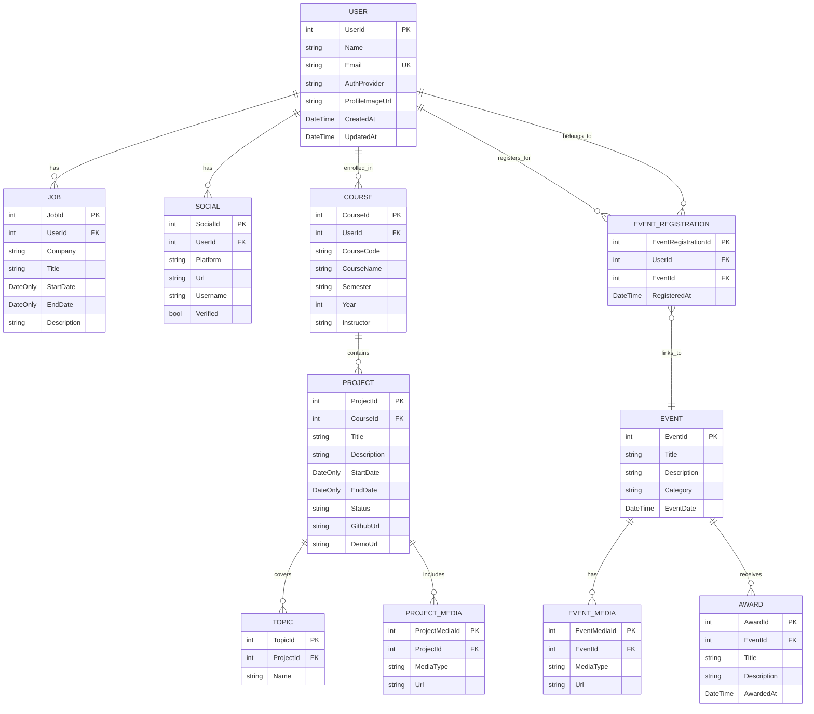

# JayWiki Database Schema

This Entity Relationship Diagram represents the current production database implementation as of March 2026. The schema was created with Entity Framework Core migrations and is deployed to Azure SQL Database.

---

## Visual ERD (Mermaid Diagram)

The following diagram renders automatically on GitHub. For VS Code preview, install the "Markdown Preview Mermaid Support" extension.



---

## Entities and Attributes

### 1. USER
- **UserId** (int, PK, Identity)
- **Name** (string, required)
- **Email** (string, required, unique index)
- **AuthProvider** (string, required) - "google" or "microsoft"
- **ProfileImageUrl** (string, nullable)
- **CreatedAt** (DateTime, required)
- **UpdatedAt** (DateTime, required)
- Connected to: JOB, SOCIAL, COURSE, EVENT_REGISTRATION

### 2. JOB
- **JobId** (int, PK, Identity)
- **UserId** (int, FK → USER, required)
- **Company** (string, required)
- **Title** (string, required)
- **StartDate** (DateOnly, required)
- **EndDate** (DateOnly, nullable) - Null indicates current position
- **Description** (string, nullable)
- Connected to: USER

### 3. SOCIAL
- **SocialId** (int, PK, Identity)
- **UserId** (int, FK → USER, required)
- **Platform** (string, required) - "github", "linkedin", "website", etc.
- **Url** (string, required)
- **Username** (string, nullable)
- **Verified** (bool, required, default: false)
- Connected to: USER

### 4. COURSE
- **CourseId** (int, PK, Identity)
- **UserId** (int, FK → USER, required)
- **CourseCode** (string, required) - e.g., "CS301"
- **CourseName** (string, required)
- **Semester** (string, required) - "Fall", "Spring", "Summer"
- **Year** (int, required)
- **Instructor** (string, nullable)
- Connected to: USER, PROJECT

### 5. PROJECT
- **ProjectId** (int, PK, Identity)
- **CourseId** (int, FK → COURSE, required)
- **Title** (string, required)
- **Description** (string, nullable)
- **StartDate** (DateOnly, nullable)
- **EndDate** (DateOnly, nullable)
- **Status** (string, required, default: "active") - "active", "completed", "archived"
- **GithubUrl** (string, nullable)
- **DemoUrl** (string, nullable)
- Connected to: COURSE, TOPIC, PROJECT_MEDIA

### 6. PROJECT_MEDIA
- **ProjectMediaId** (int, PK, Identity)
- **ProjectId** (int, FK → PROJECT, required)
- **MediaType** (string, required) - "image", "video", "link"
- **Url** (string, required)
- Connected to: PROJECT

### 7. TOPIC
- **TopicId** (int, PK, Identity)
- **ProjectId** (int, FK → PROJECT, required)
- **Name** (string, required) - Technology/topic tags
- Connected to: PROJECT

### 8. EVENT
- **EventId** (int, PK, Identity)
- **Title** (string, required)
- **Description** (string, nullable)
- **Category** (string, required) - "club", "sport", "academic", "other"
- **EventDate** (DateTime, required)
- Connected to: EVENT_REGISTRATION, EVENT_MEDIA, AWARD
- Note: Supports clubs, sports, academics, and other campus activities

### 9. EVENT_REGISTRATION
- **EventRegistrationId** (int, PK, Identity)
- **UserId** (int, FK → USER, required)
- **EventId** (int, FK → EVENT, required)
- **RegisteredAt** (DateTime, required)
- Connected to: USER, EVENT
- **Constraint**: Composite unique index on (UserId, EventId) prevents duplicate registrations

### 10. EVENT_MEDIA
- **EventMediaId** (int, PK, Identity)
- **EventId** (int, FK → EVENT, required)
- **MediaType** (string, required) - "image", "video", "link"
- **Url** (string, required)
- Connected to: EVENT

### 11. AWARD
- **AwardId** (int, PK, Identity)
- **EventId** (int, FK → EVENT, required)
- **Title** (string, required)
- **Description** (string, nullable)
- **AwardedAt** (DateTime, required)
- Connected to: EVENT

---

## Relationships

```
USER ──────< JOB                    (One-to-Many)
USER ──────< SOCIAL                 (One-to-Many)
USER ──────< COURSE                 (One-to-Many)
USER ──────< EVENT_REGISTRATION     (One-to-Many)

COURSE ────< PROJECT                (One-to-Many)

PROJECT ───< TOPIC                  (One-to-Many)
PROJECT ───< PROJECT_MEDIA          (One-to-Many)

EVENT_REGISTRATION >──── EVENT      (Many-to-One)
EVENT_REGISTRATION >──── USER       (Many-to-One)

EVENT ─────< EVENT_MEDIA            (One-to-Many)
EVENT ─────< AWARD                  (One-to-Many)
```

### Cardinality Notes:
- **One-to-Many (──────<)**: Parent can have multiple children, child belongs to one parent
- **Many-to-One (>────)**: Multiple children reference one parent
- **Many-to-Many**: USER ←→ EVENT through EVENT_REGISTRATION junction table

---

## Implementation Details

### Database Constraints & Indexes

**Unique Constraints:**
- `USER.Email` - Unique index (prevents duplicate email addresses across authentication providers)
- `EVENT_REGISTRATION(UserId, EventId)` - Composite unique index (prevents duplicate event registrations)

**Foreign Key Behavior:**
- All foreign keys configured with **CASCADE DELETE**
- When a USER is deleted, all associated JOBs, SOCIALs, COURSEs, and EVENT_REGISTRATIONs are deleted
- When a COURSE is deleted, all associated PROJECTs are deleted
- When a PROJECT is deleted, all associated TOPICs and PROJECT_MEDIA are deleted
- When an EVENT is deleted, all associated EVENT_REGISTRATIONs, EVENT_MEDIA, and AWARDs are deleted

**Indexes:**
- Primary key indexes on all `*Id` columns (automatic with Identity)
- Foreign key indexes on all `UserId`, `CourseId`, `ProjectId`, `EventId` columns (automatic with relationships)

### Data Type Specifications

| Type | SQL Server Type | Usage |
|------|----------------|--------|
| `int` (PK) | `int IDENTITY(1,1)` | Auto-incrementing primary keys |
| `int` (FK) | `int` | Foreign key references |
| `string` (required) | `nvarchar(max)` | Text fields that cannot be null |
| `string` (nullable) | `nvarchar(max) NULL` | Optional text fields |
| `DateTime` | `datetime2` | Timestamps with UTC storage |
| `DateOnly` | `date` | Date-only fields (no time component) |
| `bool` | `bit` | Boolean flags |

**Storage Notes:**
- All `DateTime` values stored as UTC in the database
- Application code converts to local time zones as needed
- `DateOnly` used for employment dates, project dates to avoid timezone confusion
- `nvarchar(max)` allows unlimited text length (URLs, descriptions, etc.)

### Authentication & Authorization

**Supported OAuth Providers:**
1. **Google OAuth 2.0**
   - Validates ID tokens against `clientId`
   - Claims: `email`, `name`, `iss` (issuer contains "accounts.google.com")
   - Used for: Personal Google accounts

2. **Microsoft Entra ID (formerly Azure AD)**
   - Validates access tokens with Microsoft common endpoint
   - Supports both organizational (@etown.edu) and personal Microsoft accounts
   - Claims: `preferred_username` or `upn` for email, `name`
   - Used for: Campus Microsoft 365 accounts + personal Microsoft accounts

**User Provisioning:**
- Users automatically created on first login via `POST /api/users/me`
- Email extracted from OAuth token claims (with fallback logic for Microsoft accounts)
- `AuthProvider` field tracks which provider authenticated the user
- Race condition protection on concurrent first logins (handles SQL unique constraint violations)

**Backend Implementation:**
- Dual JWT Bearer authentication schemes (one for Google, one for Microsoft)
- Policy-based scheme selector inspects token `iss` claim
- All API endpoints protected with `[Authorize]` attribute by default
- Public endpoints explicitly marked with `[AllowAnonymous]`

---

## Media Storage Strategy

**File Storage:**
- All media URLs point to Azure Blob Storage (not yet implemented)
- Media entities (`PROJECT_MEDIA`, `EVENT_MEDIA`) store only URLs, not file data
- Planned storage container: `jaywiki-media` with public read access

**Media Types:**
- `"image"` - Photos, screenshots, diagrams (.jpg, .png, .gif)
- `"video"` - Demo videos, presentation recordings (.mp4, .mov)
- `"link"` - External URLs (YouTube, GitHub, documentation)

**Future Implementation:**
- Backend upload API will generate unique blob names
- Frontend will display thumbnails and full-size previews
- CDN integration for fast global delivery

---

## Planned Enhancements

### Optional Future Enhancements (Post-v1.0)
- [ ] Add `USER.Bio` (string, nullable) - Short user biography
- [ ] Add `PROJECT.Visibility` (string) - "public", "unlisted", "private"
- [ ] Add `EVENT.Location` (string, nullable) - Physical location or room number
- [ ] Add `EVENT.MaxParticipants` (int, nullable) - Capacity limit
- [ ] Add full-text search indexes on Title/Description fields
- [ ] Consider separate `SKILL` table linked to USER for skill tagging

---

## Quick Reference

**Total Entities:** 11  
**Junction Tables:** 1 (EVENT_REGISTRATION)  
**One-to-Many Relationships:** 9  
**Many-to-Many Relationships:** 1 (USER ↔ EVENT)  
**Unique Constraints:** 2  
**Database Type:** Azure SQL Database  
**ORM:** Entity Framework Core 10.0.5  

---

**Schema Version:** 1.1  
**Last Updated:** April 2026  
**Implementation Status:** ✅ Production Ready