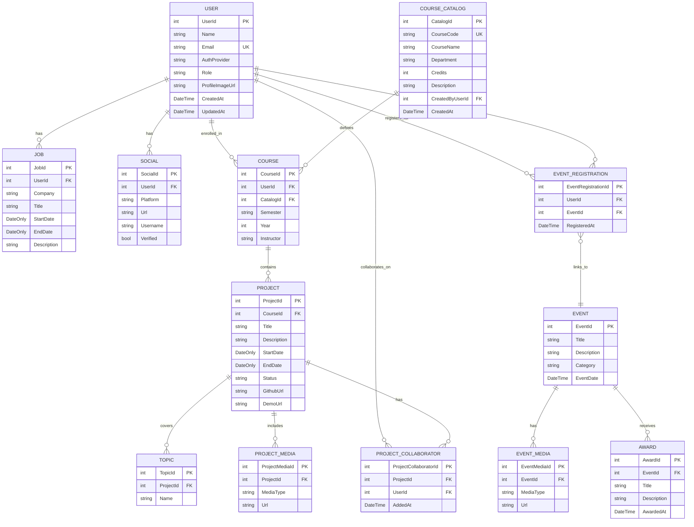

# JayWiki Database Schema

This Entity Relationship Diagram represents the current production database implementation as of April 2026. The schema was created with Entity Framework Core migrations and is deployed to Azure SQL Database.

---

## Visual ERD (Mermaid Diagram)

The following diagram renders automatically on GitHub. For VS Code preview, install the "Markdown Preview Mermaid Support" extension.



---

## Entities and Attributes

### 1. USER
- **UserId** (int, PK, Identity)
- **Name** (string, required)
- **Email** (string, required, unique index)
- **AuthProvider** (string, required) — "google" or "microsoft"
- **Role** (string, required, default: "student") — "student" | "instructor" | "admin"
- **ProfileImageUrl** (string, nullable) — Azure Blob Storage URL for profile picture
- **CreatedAt** (DateTime, required)
- **UpdatedAt** (DateTime, required)
- Connected to: JOB, SOCIAL, COURSE, EVENT_REGISTRATION, PROJECT_COLLABORATOR

### 2. JOB
- **JobId** (int, PK, Identity)
- **UserId** (int, FK → USER, required)
- **Company** (string, required)
- **Title** (string, required)
- **StartDate** (DateOnly, required)
- **EndDate** (DateOnly, nullable) — Null indicates current position
- **Description** (string, nullable)
- Connected to: USER

### 3. SOCIAL
- **SocialId** (int, PK, Identity)
- **UserId** (int, FK → USER, required)
- **Platform** (string, required) — "github", "linkedin", "website", etc.
- **Url** (string, required)
- **Username** (string, nullable)
- **Verified** (bool, required, default: false)
- Connected to: USER

### 4. COURSE_CATALOG
- **CatalogId** (int, PK, Identity)
- **CourseCode** (string, required, unique) — e.g., "CS301" — always stored uppercase
- **CourseName** (string, required) — e.g., "Data Structures"
- **Department** (string, nullable) — e.g., "Computer Science"
- **Credits** (int, nullable)
- **Description** (string, nullable)
- **CreatedByUserId** (int, FK → USER, required) — instructor who created the entry
- **CreatedAt** (DateTime, required)
- Connected to: COURSE
- **Note:** Managed by instructors/admins only. Source of truth for course codes and names across all students. Prevents free-text inconsistencies (e.g., "CS301" vs "CS 301" vs "Comp Sci 301").

### 5. COURSE *(enrollment record)*
- **CourseId** (int, PK, Identity)
- **UserId** (int, FK → USER, required) — the enrolled student
- **CatalogId** (int, FK → COURSE_CATALOG, required) — canonical course reference
- **Semester** (string, required) — "Fall", "Spring", "Summer"
- **Year** (int, required)
- **Instructor** (string, nullable) — semester-specific instructor name
- Connected to: USER, COURSE_CATALOG, PROJECT
- **Note:** Replaces the old CLASS entity. `CourseCode` and `CourseName` are no longer stored here — they are derived from COURSE_CATALOG via CatalogId. A student can enroll in the same catalog course multiple times across different semesters/years.

### 6. PROJECT
- **ProjectId** (int, PK, Identity)
- **CourseId** (int, FK → COURSE, required)
- **Title** (string, required)
- **Description** (string, nullable)
- **StartDate** (DateOnly, nullable)
- **EndDate** (DateOnly, nullable)
- **Status** (string, required, default: "active") — "active", "completed", "archived"
- **GithubUrl** (string, nullable)
- **DemoUrl** (string, nullable)
- Connected to: COURSE, TOPIC, PROJECT_MEDIA, PROJECT_COLLABORATOR

### 7. PROJECT_COLLABORATOR
- **ProjectCollaboratorId** (int, PK, Identity)
- **ProjectId** (int, FK → PROJECT, required)
- **UserId** (int, FK → USER, required)
- **AddedAt** (DateTime, required)
- Connected to: PROJECT, USER
- **Constraint:** Composite unique index on (ProjectId, UserId) prevents duplicate collaborators
- **Note:** Stores teammates/partners on a project. The project owner is determined implicitly via `Project → Course → UserId`. Only the owner can add or remove collaborators. Both the owner and collaborators can create, edit, and delete topics and other project content.

### 8. PROJECT_MEDIA
- **ProjectMediaId** (int, PK, Identity)
- **ProjectId** (int, FK → PROJECT, required)
- **MediaType** (string, required) — "image", "video", "link"
- **Url** (string, required)
- Connected to: PROJECT

### 9. TOPIC
- **TopicId** (int, PK, Identity)
- **ProjectId** (int, FK → PROJECT, required)
- **Name** (string, required) — Technology/topic tags
- Connected to: PROJECT
- **Constraint:** Topic names are unique per project (duplicate names on the same project are rejected)

### 10. EVENT
- **EventId** (int, PK, Identity)
- **Title** (string, required)
- **Description** (string, nullable)
- **Category** (string, required) — "club", "sport", "academic", "other"
- **EventDate** (DateTime, required)
- Connected to: EVENT_REGISTRATION, EVENT_MEDIA, AWARD
- Note: Supports clubs, sports, academics, and other campus activities

### 11. EVENT_REGISTRATION
- **EventRegistrationId** (int, PK, Identity)
- **UserId** (int, FK → USER, required)
- **EventId** (int, FK → EVENT, required)
- **RegisteredAt** (DateTime, required)
- Connected to: USER, EVENT
- **Constraint:** Composite unique index on (UserId, EventId) prevents duplicate registrations

### 12. EVENT_MEDIA
- **EventMediaId** (int, PK, Identity)
- **EventId** (int, FK → EVENT, required)
- **MediaType** (string, required) — "image", "video", "link"
- **Url** (string, required)
- Connected to: EVENT

### 13. AWARD
- **AwardId** (int, PK, Identity)
- **EventId** (int, FK → EVENT, required)
- **Title** (string, required)
- **Description** (string, nullable)
- **AwardedAt** (DateTime, required)
- Connected to: EVENT

---

## Relationships

```
USER ──────< JOB                      (One-to-Many)
USER ──────< SOCIAL                   (One-to-Many)
USER ──────< COURSE                   (One-to-Many)
USER ──────< EVENT_REGISTRATION       (One-to-Many)
USER ──────< PROJECT_COLLABORATOR     (One-to-Many)

COURSE_CATALOG ────< COURSE           (One-to-Many)

COURSE ────< PROJECT                  (One-to-Many)

PROJECT ───< TOPIC                    (One-to-Many)
PROJECT ───< PROJECT_MEDIA            (One-to-Many)
PROJECT ───< PROJECT_COLLABORATOR     (One-to-Many)

EVENT_REGISTRATION >──── EVENT        (Many-to-One)
EVENT_REGISTRATION >──── USER         (Many-to-One)

EVENT ─────< EVENT_MEDIA              (One-to-Many)
EVENT ─────< AWARD                    (One-to-Many)
```

### Cardinality Notes:
- **One-to-Many (──────<)**: Parent can have multiple children, child belongs to one parent
- **Many-to-One (>────)**: Multiple children reference one parent
- **Many-to-Many**: USER ←→ EVENT through EVENT_REGISTRATION junction table
- **Many-to-Many**: USER ←→ PROJECT through PROJECT_COLLABORATOR junction table (owner is implicit via Course)

---

## Authorization Model

### User Roles
| Role | Assigned By | Permissions |
|------|-------------|-------------|
| `student` | Default on registration | Manage own courses, projects, jobs, socials |
| `instructor` | Manual DB assignment | All student permissions + manage COURSE_CATALOG |
| `admin` | Manual DB assignment | All instructor permissions |

### Project Ownership vs Collaboration
| Action | Owner | Collaborator | Anyone |
|--------|-------|--------------|--------|
| View project | ✅ | ✅ | ✅ |
| Add/remove collaborators | ✅ | ❌ | ❌ |
| Create/edit/delete topics | ✅ | ✅ | ❌ |
| Create/edit/delete project media | ✅ | ✅ | ❌ |

The project **owner** is always the user who owns the COURSE the project belongs to (`Project → Course → UserId`). Collaborators are stored explicitly in PROJECT_COLLABORATOR.

### Course Catalog Access
| Action | Student | Instructor/Admin |
|--------|---------|-----------------|
| View catalog | ✅ | ✅ |
| View enrollments across all students | ✅ | ✅ |
| Add/edit/delete catalog entries | ❌ | ✅ |
| Enroll self in a course | ✅ | ✅ |
| Enroll another user in a course | ❌ | ✅ |

---

## Implementation Details

### Database Constraints & Indexes

**Unique Constraints:**
- `USER.Email` — Unique index (prevents duplicate email addresses across authentication providers)
- `COURSE_CATALOG.CourseCode` — Unique index (prevents duplicate course codes; always stored uppercase)
- `PROJECT_COLLABORATOR(ProjectId, UserId)` — Composite unique index (prevents duplicate collaborators)
- `EVENT_REGISTRATION(UserId, EventId)` — Composite unique index (prevents duplicate event registrations)
- `TOPIC(ProjectId, Name)` — Duplicate topic names rejected per project at application layer

**Foreign Key Behavior:**
- `USER` deleted → cascades to JOB, SOCIAL, COURSE, EVENT_REGISTRATION, PROJECT_COLLABORATOR
- `COURSE` deleted → cascades to PROJECT
- `PROJECT` deleted → cascades to TOPIC, PROJECT_MEDIA, PROJECT_COLLABORATOR
- `EVENT` deleted → cascades to EVENT_REGISTRATION, EVENT_MEDIA, AWARD
- `COURSE_CATALOG` deleted → **restricted** if any COURSE enrollments exist (prevents orphaned enrollment records)
- `COURSE_CATALOG.CreatedByUserId` → **restricted** (deleting an instructor does not delete the catalog)

**Indexes:**
- Primary key indexes on all `*Id` columns (automatic with Identity)
- Foreign key indexes on all FK columns (automatic with relationships)

### Data Type Specifications

| Type | SQL Server Type | Usage |
|------|----------------|--------|
| `int` (PK) | `int IDENTITY(1,1)` | Auto-incrementing primary keys |
| `int` (FK) | `int` | Foreign key references |
| `string` (required) | `nvarchar(max)` | Text fields that cannot be null |
| `string` (nullable) | `nvarchar(max) NULL` | Optional text fields |
| `DateTime` | `datetime2` | Timestamps with UTC storage |
| `DateOnly` | `date` | Date-only fields (no time component) |
| `bool` | `bit` | Boolean flags |

**Storage Notes:**
- All `DateTime` values stored as UTC in the database
- Application code converts to local time zones as needed
- `DateOnly` used for employment dates, project dates to avoid timezone confusion
- `nvarchar(max)` allows unlimited text length (URLs, descriptions, etc.)
- Course codes normalized to uppercase on write

### Authentication & Authorization

**Supported OAuth Providers:**
1. **Google OAuth 2.0**
   - Validates ID tokens against `clientId`
   - Claims: `email`, `name`, `iss` (issuer contains "accounts.google.com")

2. **Microsoft Entra ID (formerly Azure AD)**
   - Validates access tokens with Microsoft common endpoint
   - Supports both organizational (@etown.edu) and personal Microsoft accounts
   - Claims: `preferred_username` or `upn` for email, `name`

**User Provisioning:**
- Users automatically created on first login via `POST /api/users/me`
- Default role assigned as `"student"` on creation
- `AuthProvider` field tracks which provider authenticated the user
- Race condition protection on concurrent first logins

**Backend Implementation:**
- Dual JWT Bearer authentication schemes (one for Google, one for Microsoft)
- Policy-based scheme selector inspects token `iss` claim
- Role checked at application layer via `currentUser.Role` (not claims-based)
- Shared `ProjectBaseController` base class provides reusable helpers: `GetCurrentUserAsync()`, `IsProjectMemberAsync()`, `IsProjectOwnerAsync()`, `IsInstructorOrAdminAsync()`

---

## API Endpoints

### Course Catalog (`/api/courses`)
| Method | Endpoint | Auth | Description |
|--------|----------|------|-------------|
| GET | `/api/courses` | Public | List all catalog entries (supports `?department=` and `?search=` filters) |
| GET | `/api/courses/{id}` | Public | Get a single catalog entry |
| GET | `/api/courses/{id}/enrollments` | Public | All students enrolled + their projects for this course |
| POST | `/api/courses` | Instructor/Admin | Add new course to catalog |
| PUT | `/api/courses/{id}` | Instructor/Admin | Update catalog entry |
| DELETE | `/api/courses/{id}` | Instructor/Admin | Delete catalog entry (blocked if enrollments exist) |

### Course Enrollments (`/api/users/{userId}/courses`)
| Method | Endpoint | Auth | Description |
|--------|----------|------|-------------|
| GET | `/api/users/{userId}/courses` | Public | List a student's enrolled courses |
| GET | `/api/users/{userId}/courses/{id}` | Public | Get enrollment detail with projects |
| POST | `/api/users/{userId}/courses` | Owner or Instructor/Admin | Enroll in a course |
| PUT | `/api/users/{userId}/courses/{id}` | Owner or Instructor/Admin | Update enrollment (semester, year, instructor) |
| DELETE | `/api/users/{userId}/courses/{id}` | Owner or Instructor/Admin | Remove enrollment |

### Topics (`/api/projects/{projectId}/topics`)
| Method | Endpoint | Auth | Description |
|--------|----------|------|-------------|
| GET | `/api/projects/{projectId}/topics` | Public | List all topics for a project |
| GET | `/api/projects/{projectId}/topics/{id}` | Public | Get a single topic |
| POST | `/api/projects/{projectId}/topics` | Owner or Collaborator | Add topic to project |
| PUT | `/api/projects/{projectId}/topics/{id}` | Owner or Collaborator | Update topic name |
| DELETE | `/api/projects/{projectId}/topics/{id}` | Owner or Collaborator | Delete topic |

### Project Collaborators (`/api/projects/{projectId}/collaborators`)
| Method | Endpoint | Auth | Description |
|--------|----------|------|-------------|
| GET | `/api/projects/{projectId}/collaborators` | Public | List collaborators on a project |
| POST | `/api/projects/{projectId}/collaborators` | Owner only | Add collaborator by email |
| DELETE | `/api/projects/{projectId}/collaborators/{userId}` | Owner only | Remove collaborator |

### Users (`/api/users`)
| Method | Endpoint | Auth | Description |
|--------|----------|------|-------------|
| GET | `/api/users` | Public | List all users (names only) |
| GET | `/api/users/me` | Authenticated | Get current user profile |
| POST | `/api/users/me` | Authenticated | Upsert user on first login |
| PUT | `/api/users/me` | Authenticated | Update profile fields |
| POST | `/api/users/me/profile-image` | Authenticated | Upload profile picture to Azure Blob Storage |

---

## Media Storage Strategy

**File Storage:**
- All media URLs point to Azure Blob Storage
- Media entities (`PROJECT_MEDIA`, `EVENT_MEDIA`) store only URLs, not file data
- Profile images stored in Azure Blob Storage, URL saved to `USER.ProfileImageUrl`
- Planned storage container: `jaywiki-media` with public read access

**Media Types:**
- `"image"` — Photos, screenshots, diagrams (.jpg, .png, .gif, .webp)
- `"video"` — Demo videos, presentation recordings (.mp4, .mov)
- `"link"` — External URLs (YouTube, GitHub, documentation)

**Profile Image Upload:**
- Max file size: 5 MB
- Allowed types: JPEG, PNG, GIF, WEBP
- Old blob deleted after new URL is safely persisted (best-effort cleanup)
- Upload endpoint: `POST /api/users/me/profile-image` (multipart/form-data)

---

## Planned Enhancements (Post-v1.0)

- [ ] Add `USER.Bio` (string, nullable) — Short user biography
- [ ] Add `PROJECT.Visibility` (string) — "public", "unlisted", "private"
- [ ] Add `EVENT.Location` (string, nullable) — Physical location or room number
- [ ] Add `EVENT.MaxParticipants` (int, nullable) — Capacity limit
- [ ] Add full-text search indexes on Title/Description fields
- [ ] Consider separate `SKILL` table linked to USER for skill tagging
- [ ] Role assignment UI for promoting users to instructor/admin

---

## Quick Reference

**Total Entities:** 13
**Junction Tables:** 2 (EVENT_REGISTRATION, PROJECT_COLLABORATOR)
**One-to-Many Relationships:** 11
**Many-to-Many Relationships:** 2 (USER ↔ EVENT, USER ↔ PROJECT)
**Unique Constraints:** 4
**Database Type:** Azure SQL Database
**ORM:** Entity Framework Core 10.0.5

---

**Schema Version:** 1.2
**Last Updated:** April 2026
**Implementation Status:** ✅ Production Ready