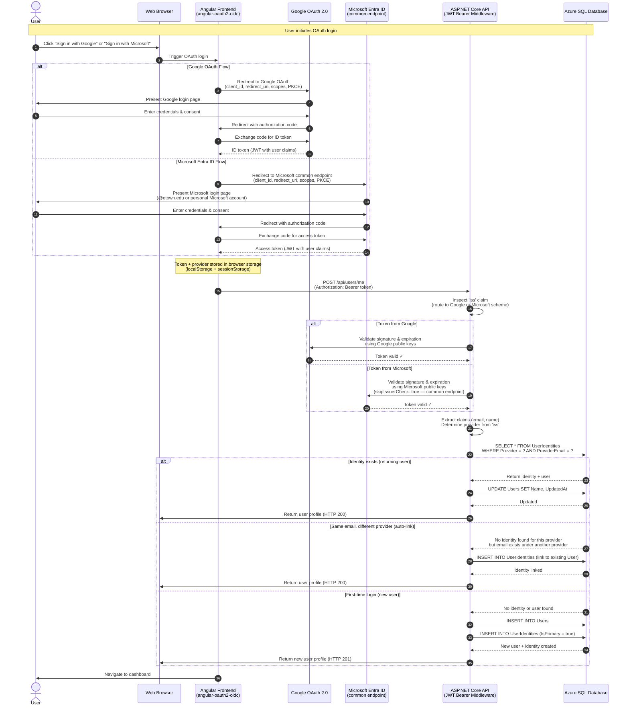
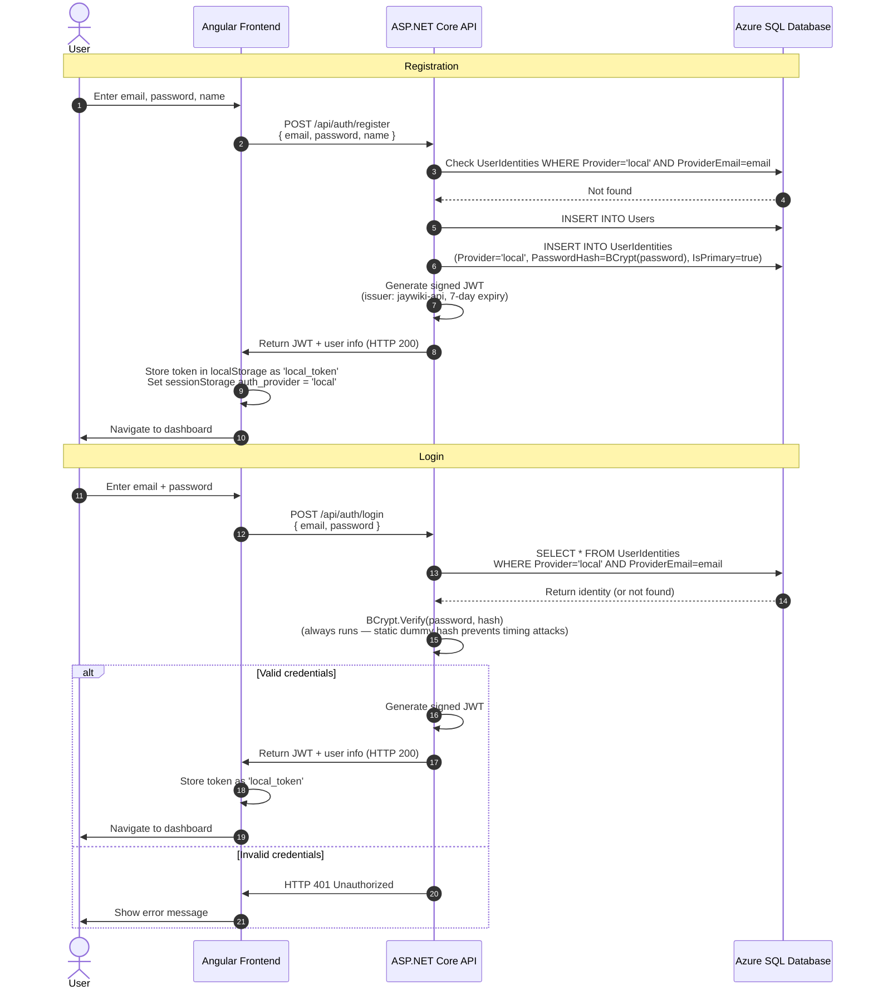
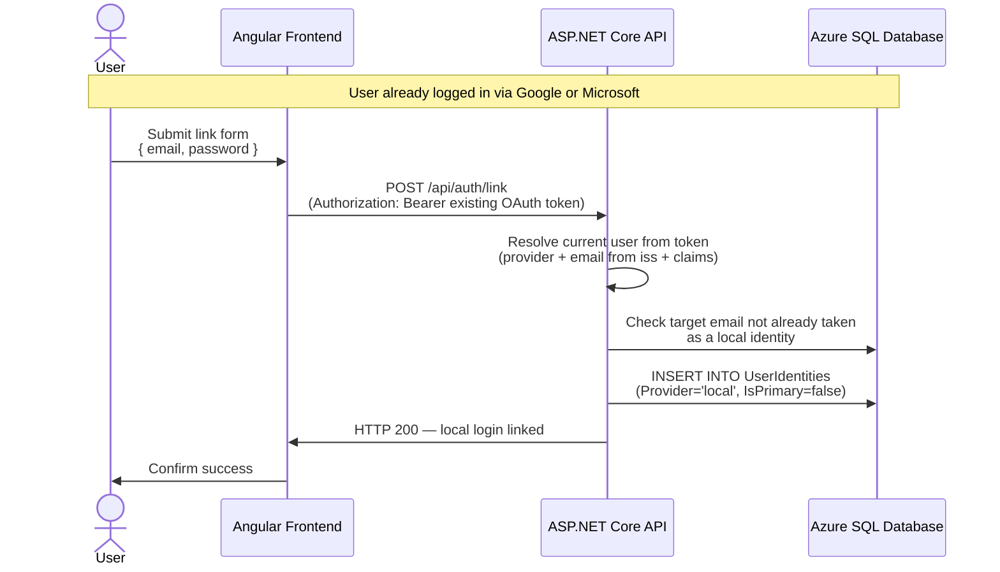
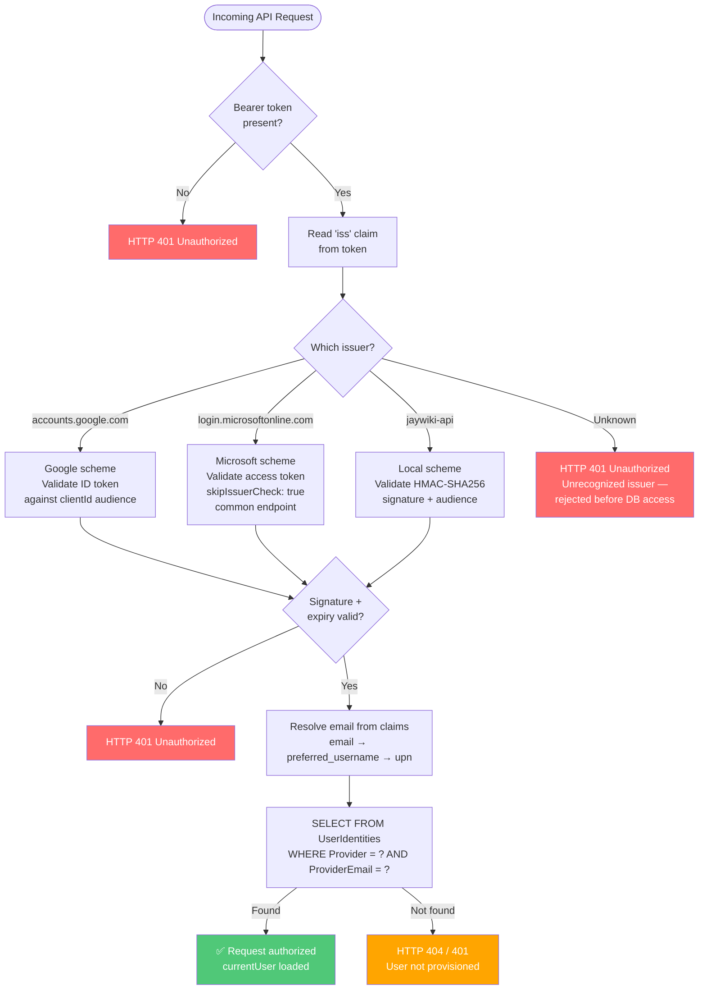

# Authentication Flow Diagram

This diagram shows the three supported authentication flows: Google OAuth 2.0, Microsoft Entra ID, and local email/password. The `angular-oauth2-oidc` library handles frontend OAuth token acquisition, while ASP.NET Core JWT Bearer middleware validates all tokens on the backend.

---

## Complete OAuth Flow (Google or Microsoft)

---

## Local Email/Password Flow

---

## Linking Additional Providers

---

## Token Validation Detail

---

## Flow Explanation

### OAuth (Google / Microsoft)

**Phase 1 — Provider Selection**
User clicks Google or Microsoft button. Frontend sets `auth_provider` in `sessionStorage` and configures `angular-oauth2-oidc` with the appropriate `AuthConfig`.

**Phase 2 — OAuth Provider Authentication**
Frontend uses PKCE code flow. User authenticates with their provider. Google returns an ID token; Microsoft returns an access token. Both are JWTs containing user claims.

**Phase 3 — Token Storage**
`angular-oauth2-oidc` stores the token in `localStorage`. The interceptor reads it on every subsequent request and attaches it as a `Bearer` header automatically.

**Phase 4 — User Upsert**
After OAuth completes, `tryRestoreSession()` calls `POST /api/users/me` with the token. The backend creates or updates the user's `UserIdentity` and `User` rows. If the same email exists under another provider, the new identity is linked to the existing user automatically.

**Phase 5 — Navigation**
After successful upsert, the frontend navigates to `/dashboard`.

### Local (Email + Password)

Login and registration are handled entirely by the frontend form — no OAuth redirect. The backend issues its own signed JWT. The Angular interceptor checks `sessionStorage auth_provider === 'local'` and reads the token from `localStorage local_token` instead of `angular-oauth2-oidc`.

---

## Security Features

### Frontend (angular-oauth2-oidc)
- **PKCE:** Prevents authorization code interception attacks
- **State parameter:** Prevents CSRF during OAuth callback
- **Provider isolation:** `auth_provider` in `sessionStorage` ensures correct token type is sent per provider
- **Interceptor:** Automatically attaches the correct Bearer token based on active provider

### Backend (ASP.NET Core JWT Bearer)
- **Triple authentication schemes:** "Google", "Microsoft", "Local" — each with independent validation
- **Policy-based MultiScheme selector:** Routes to correct scheme by inspecting `iss` claim before validation
- **Unrecognized issuer rejection:** Tokens from unknown issuers rejected before any DB access
- **Provider-scoped user lookup:** `UserIdentity` queried by both `Provider` AND `ProviderEmail` — prevents cross-provider identity confusion
- **BCrypt password hashing:** Passwords never stored in plain text; static dummy hash prevents timing-based user enumeration
- **Audience validation:** Ensures tokens were issued for this API
- **Signature verification:** Cryptographic validation using provider public keys
- **`skipIssuerCheck: true` for Microsoft:** Required because the `common` endpoint issues tokens with tenant-specific issuers that don't match the common issuer URL

---

## Configuration Details

### Google OAuth
- **Issuer:** `https://accounts.google.com`
- **Scopes:** `openid profile email`
- **Token type sent to backend:** ID token
- **Audience validated against:** Google `clientId`
- **Note:** `dummyClientSecret` required by `angular-oauth2-oidc` for SPA code flow — not a real secret

### Microsoft Entra ID
- **Issuer:** `https://login.microsoftonline.com/common/v2.0` (common endpoint)
- **App registration:** Personal `etownjaywiki@outlook.com` account — not school tenant (school IT blocks tenant-level registration)
- **Supported accounts:** Organizational (@etown.edu) AND personal Microsoft accounts
- **Scopes:** `openid profile email`
- **Token type sent to backend:** Access token
- **`skipIssuerCheck: true`:** Required — common endpoint tokens have tenant-specific issuers
- **Backend `ValidateIssuer: false`:** Issuer validation disabled; security maintained via signature + audience validation

### Local (Email + Password)
- **Issuer:** `jaywiki-api` (backend-issued)
- **Algorithm:** HMAC-SHA256 with symmetric signing key
- **Signing key:** Stored in `.env` as `JWT_SIGNING_KEY` (min 32 chars), injected via `JwtSigningConfig` singleton
- **Token expiry:** 7 days
- **Password hashing:** BCrypt with default work factor

---

## Token Lifetime

| Provider | Token Type | Expiry | Refresh |
|----------|------------|--------|---------|
| Google | ID token | 1 hour | Via refresh token (6 months rolling) |
| Microsoft | Access token | 1 hour | Via refresh token (90 days) |
| Local | Backend JWT | 7 days | Re-login required |