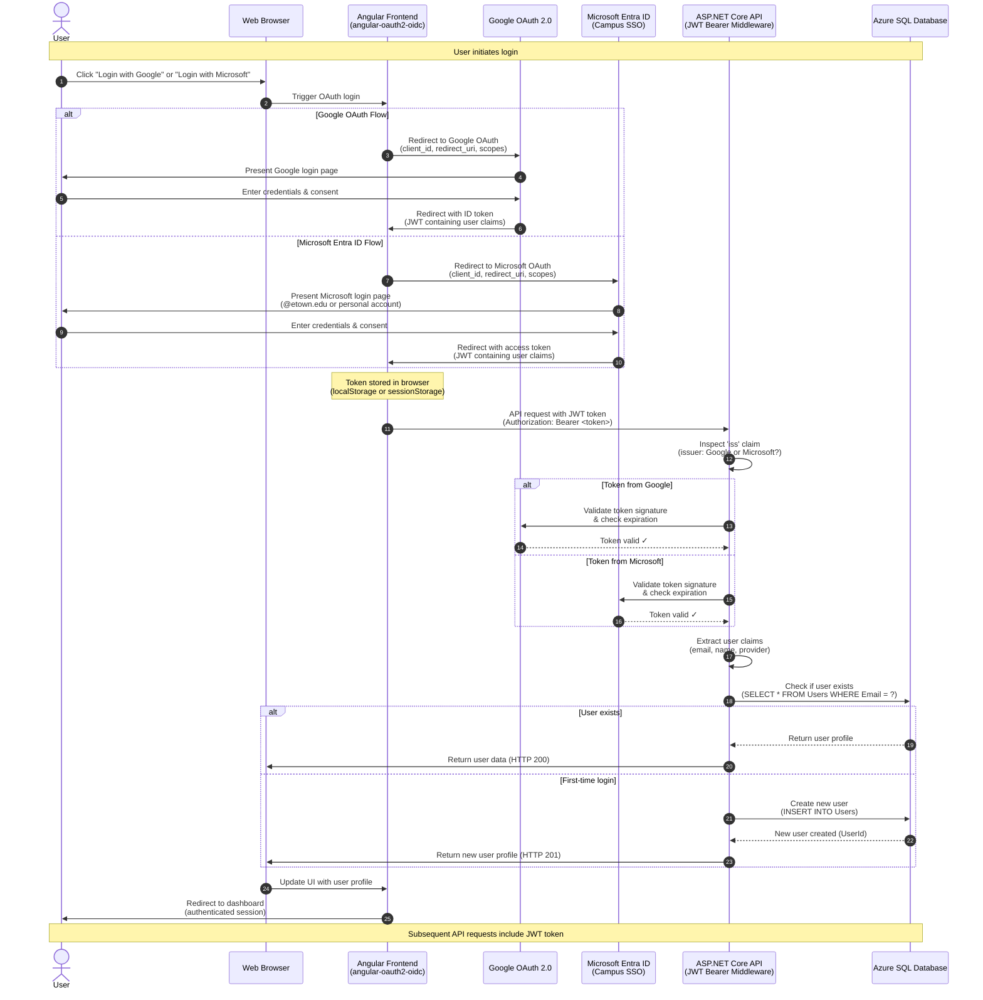
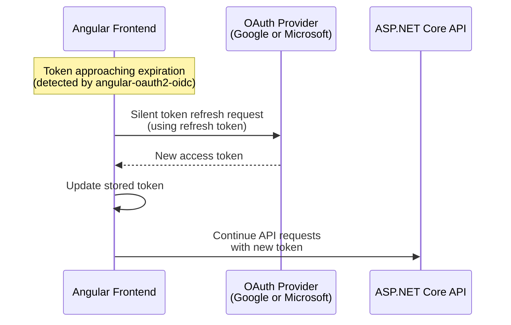
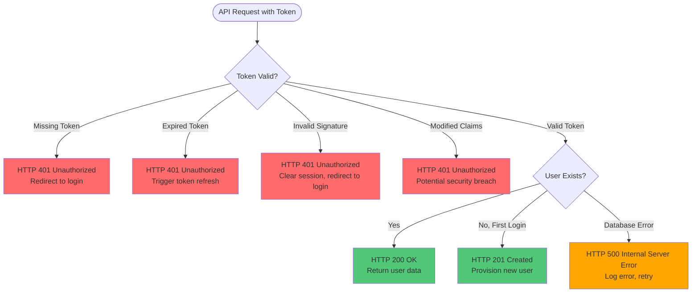

# Authentication Flow Diagram

This diagram shows the OAuth 2.0 authentication flows for both Microsoft Entra ID (campus users) and Google OAuth (external users). The angular-oauth2-oidc library handles frontend token acquisition, while ASP.NET Core JWT Bearer middleware validates tokens on the backend.

## Complete OAuth Flow (Google or Microsoft)

## Detailed Flow Explanation

### Phase 1: OAuth Provider Selection (Steps 1-2)
- User clicks login button choosing Google or Microsoft
- Frontend initiates OAuth flow with selected provider

### Phase 2: OAuth Provider Authentication (Steps 3-6)
**For Google:**
- Frontend redirects to `accounts.google.com` with client_id and scopes
- User authenticates and grants consent
- Google returns ID token (JWT) to frontend via redirect URI

**For Microsoft Entra ID:**
- Frontend redirects to `login.microsoftonline.com` with client_id and scopes
- User authenticates with @etown.edu campus credentials or personal Microsoft account
- Microsoft returns access token (JWT) to frontend via redirect URI

### Phase 3: Token Storage (Step 7)
- angular-oauth2-oidc library stores token in browser storage
- Token persists across page refreshes
- Token includes expiration time for automatic refresh

### Phase 4: Backend API Request (Step 8)
- Frontend includes JWT in Authorization header: `Bearer <token>`
- All protected endpoints require valid token

### Phase 5: Token Validation (Steps 9-12)
- Backend inspects `iss` (issuer) claim to determine provider
- Policy-based scheme selector routes to appropriate validation endpoint
- Token signature verified using provider's public keys
- Token expiration checked

### Phase 6: User Provisioning (Steps 13-17)
- Extract email, name, and provider from token claims
- Check if user exists in database by email
- **If existing user:** Return user profile
- **If new user:** Create user record via `POST /api/users/me` endpoint
- Return user data to frontend

### Phase 7: Session Establishment (Steps 18-19)
- Frontend updates UI with user profile information
- User redirected to authenticated dashboard
- Subsequent requests automatically include token

## Token Refresh Flow

## Error Handling Scenarios

## Security Features

### Frontend (angular-oauth2-oidc)
- **PKCE (Proof Key for Code Exchange):** Prevents authorization code interception
- **State Parameter:** Prevents CSRF attacks during OAuth callback
- **Token Storage:** Secure storage in browser (with HttpOnly cookie option)
- **Automatic Refresh:** Handles token expiration seamlessly

### Backend (ASP.NET Core JWT Bearer)
- **Dual Authentication Schemes:** Separate validation for Google and Microsoft
- **Issuer Validation:** Verifies token came from trusted provider
- **Audience Validation:** Ensures token intended for this API
- **Signature Verification:** Cryptographically validates token authenticity
- **Expiration Check:** Rejects expired tokens
- **Claims Extraction:** Type-safe access to user information

## Configuration Details

### Google OAuth Configuration
- **Issuer:** `https://accounts.google.com`
- **Client ID:** Stored in Angular environment configuration
- **Scopes:** `openid profile email`
- **Token Type:** ID Token (JWT)
- **Validation Endpoint:** `https://oauth2.googleapis.com/tokeninfo`

### Microsoft Entra ID Configuration
- **Issuer:** `https://login.microsoftonline.com/{tenant}/v2.0`
- **Client ID:** Application ID from Azure App Registration
- **Tenant ID:** Elizabethtown College Azure tenant
- **Scopes:** `openid profile email`
- **Token Type:** Access Token (JWT)
- **Validation Endpoint:** Microsoft common endpoint with public keys

## Token Lifetime Settings

| Provider | Access Token | Refresh Token | ID Token |
|----------|--------------|---------------|----------|
| Google | 1 hour | 6 months (rolling) | 1 hour |
| Microsoft | 1 hour | 90 days (configurable) | 1 hour |

**Note:** Tokens automatically refresh before expiration using refresh tokens, maintaining seamless user experience.