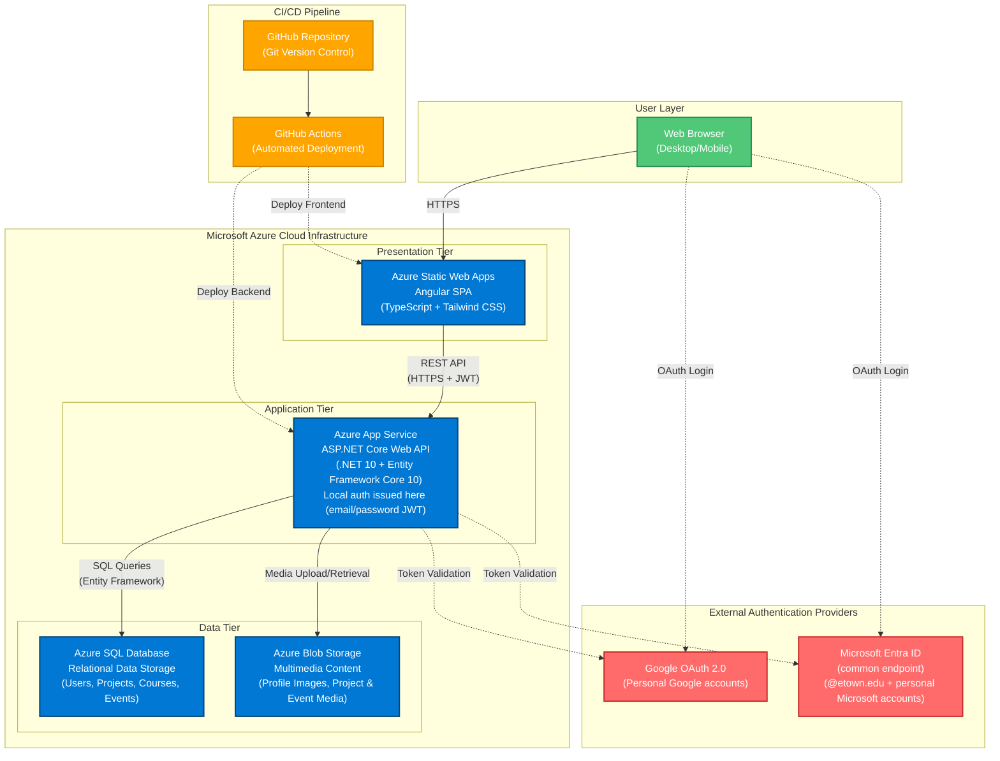

# System Architecture Diagram

This diagram shows the three-tier cloud deployment on Azure infrastructure for the JayWiki Campus Portfolio Management System.

## Diagram Legend

**User Layer (Green):**
- Web browsers (desktop and mobile) accessing the system

**Presentation Tier (Blue):**
- **Azure Static Web Apps:** Hosts Angular single-page application with global CDN distribution

**Application Tier (Blue):**
- **Azure App Service:** Hosts ASP.NET Core Web API
- Also acts as local auth issuer — generates and validates its own signed JWTs for email/password accounts (no external provider involved)

**Data Tier (Blue):**
- **Azure SQL Database:** Stores structured data (users, identities, projects, courses, events)
- **Azure Blob Storage:** Stores profile images, project media, and event media across three public-access containers (`profile-images`, `project-media`, `event-media`)

**External Authentication Providers (Red):**
- **Google OAuth 2.0:** Personal Google accounts; frontend sends ID token to backend
- **Microsoft Entra ID (common endpoint):** Supports both @etown.edu organizational accounts and personal Microsoft accounts; registered under a personal `etownjaywiki@outlook.com` app registration (school tenant registration blocked by IT); frontend sends access token to backend

**CI/CD Pipeline (Orange):**
- **GitHub:** Version control and source repository
- **GitHub Actions:** Automated build and deployment workflows — two pipelines run on every push to `main`, one for the frontend and one for the backend. EF Core migrations are applied manually via `dotnet ef database update`, not automatically by CI/CD.

## Authentication Providers Summary

| Provider | Type | Token Sent | Handled By |
|----------|------|------------|------------|
| Google OAuth 2.0 | External | ID token | Backend Google JWT scheme |
| Microsoft Entra ID | External (common endpoint) | Access token | Backend Microsoft JWT scheme |
| Local (email/password) | Internal | Backend-issued JWT | Backend Local JWT scheme |

## Key Communication Paths

- **Solid arrows (→):** Primary data flow
- **Dashed arrows (-.->):** Authentication/deployment flows
- **HTTPS:** All client-facing communications encrypted
- **JWT:** API requests authenticated with JSON Web Tokens (Google ID token, Microsoft access token, or locally-issued JWT)
- **REST API:** RESTful endpoints following standard HTTP methods

## Architecture Highlights

1. **Three-Tier Separation:** Clear separation of concerns between presentation, application, and data layers
2. **Cloud-Native:** Fully managed Azure services with automatic scaling and high availability
3. **Triple Authentication:** Google OAuth, Microsoft Entra ID (common endpoint), and local email/password — all validated via a policy-based multi-scheme JWT selector
4. **Automated Deployment:** CI/CD pipeline ensures consistent deployments via GitHub Actions on every push to `main`
5. **Cross-Region Configuration:** The current deployment has App Service in East US and SQL Database in West US 2, adding ~60–80ms cross-region latency per query. All resources should be co-located in a single region before scaling to production to reduce this to ~1–5ms.