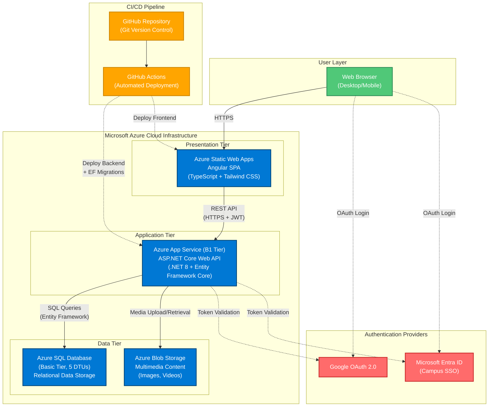

# System Architecture Diagram

This diagram shows the three-tier cloud deployment on Azure infrastructure for the JayWiki Campus Portfolio Management System.

## Diagram Legend

**User Layer (Green):**
- Web browsers (desktop and mobile) accessing the system

**Presentation Tier (Blue):**
- **Azure Static Web Apps:** Hosts Angular single-page application with global CDN distribution

**Application Tier (Blue):**
- **Azure App Service (B1):** Hosts ASP.NET Core Web API with dedicated compute resources

**Data Tier (Blue):**
- **Azure SQL Database:** Stores structured data (users, projects, courses, events)
- **Azure Blob Storage:** Stores multimedia content (images, videos)

**Authentication Providers (Red):**
- **Google OAuth 2.0:** External user authentication
- **Microsoft Entra ID:** Campus SSO for @etown.edu accounts

**CI/CD Pipeline (Orange):**
- **GitHub:** Version control and source repository
- **GitHub Actions:** Automated build, test, and deployment workflows

## Key Communication Paths

- **Solid arrows (→):** Primary data flow
- **Dashed arrows (-.->):** Authentication/deployment flows
- **HTTPS:** All client-facing communications encrypted
- **JWT:** API requests authenticated with JSON Web Tokens
- **REST API:** RESTful endpoints following standard HTTP methods

## Architecture Highlights

1. **Three-Tier Separation:** Clear separation of concerns between presentation, application, and data layers
2. **Cloud-Native:** Fully managed Azure services with automatic scaling and high availability
3. **Hybrid Authentication:** Supports both campus SSO and external OAuth providers
4. **Automated Deployment:** CI/CD pipeline ensures consistent deployments
5. **Cross-Region Configuration:** App Service (East US) and SQL Database (West US 2) - noted as area for future optimization