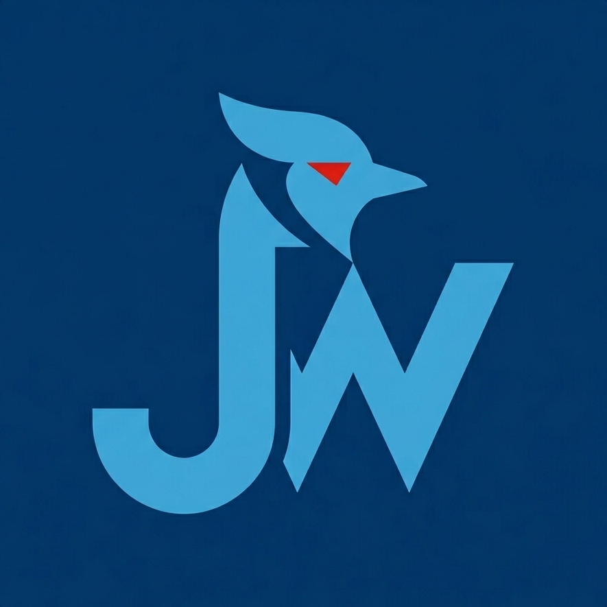

# JayWiki




**JayWiki** is a cloud-based campus portfolio management system for the School of Engineering and Computer Science at Elizabethtown College. Students can document and showcase academic projects, courses, events, and achievements — all in one place. Faculty can manage the course catalog, and the public can browse a gallery of student work.

---

## 🌐 Live Demo

> **Production App:** [jaywiki-current-prod](https://ashy-tree-0238aca0f.4.azurestaticapps.net)

📺 **Demo Video:** [demo](https://youtu.be/g_37lvpSnxg)

---

## 📚 Documentation

For detailed guides, technical info, and step-by-step instructions, visit our wiki:

- [Home](https://github.com/Etown-CS/JayWiki/wiki) – Overview, app idea, and motivation
- [Core Features](https://github.com/Etown-CS/JayWiki/wiki/Core-Features) – All features available in JayWiki
- [Installation & Setup](https://github.com/Etown-CS/JayWiki/wiki/Installation-&-Setup) – How to run the project locally
- [Technical Stack](https://github.com/Etown-CS/JayWiki/wiki/Technical-Stack) – Frontend, backend, and libraries
- [Project Structure](https://github.com/Etown-CS/JayWiki/wiki/Project-Structure) – Directory structure and file organization
- [API Documentation](https://github.com/Etown-CS/JayWiki/wiki/API-Documentation) – Comprehensive API reference with examples
- [System Architecture](https://github.com/Etown-CS/JayWiki/wiki/System-Architecture) – Azure infrastructure and three-tier architecture diagram
- [Authentication Flow](https://github.com/Etown-CS/JayWiki/wiki/Authentication-Flow) – OAuth and local auth flows with sequence diagrams
- [Database Schema](https://github.com/Etown-CS/JayWiki/wiki/Database-Schema) – Entity overview, relationships, and migration history
- [External Resources](https://github.com/Etown-CS/JayWiki/wiki/External-Resources) – Azure, Google, and Microsoft service accounts
- [Future Implementations](https://github.com/Etown-CS/JayWiki/wiki/Future-Implementations) – Planned features and enhancements

---

## 🚀 Quick Start

### Prerequisites

- [Node.js](https://nodejs.org/) v18 or higher
- [.NET SDK 10.0](https://dotnet.microsoft.com/download)
- [Angular CLI](https://angular.dev/tools/cli) 17+
- An [Azure](https://portal.azure.com/) account with the project resources configured

### Clone the repository

```bash
git clone https://github.com/Etown-CS/JayWiki.git
cd JayWiki
```

### Set up the backend

```bash
cd Backend
cp ../.env.example .env
# Fill in your values in .env (connection string, OAuth client IDs, JWT key, etc.)
dotnet restore
dotnet ef database update
dotnet run
```

The API will be available at **http://localhost:5227**. Swagger docs load at **http://localhost:5227/swagger**.

### Set up the frontend

```bash
cd frontend
npm install
npm start   # runs set-env.mjs then ng serve
```

The app will be available at **http://localhost:4200**.

---

## 🔐 Authentication

JayWiki supports three login methods:

| Provider | Description |
|----------|-------------|
| **Google OAuth** | Personal Google accounts |
| **Microsoft Entra ID** | @etown.edu campus accounts + personal Microsoft accounts |
| **Email / Password** | Local account with BCrypt-hashed credentials |

---

## ☁️ Deployment

JayWiki is deployed on Microsoft Azure:

| Service | Resource |
|---------|----------|
| Frontend | Azure Static Web Apps |
| Backend API | Azure App Service (B1) |
| Database | Azure SQL Database (Basic 5 DTUs) |
| Media Storage | Azure Blob Storage |

Deployments to `main` are automatic via GitHub Actions.

---

## 📋 Project Info

**Capstone Project** – Elizabethtown College, School of Engineering and Computer Science  
**Advisor** – Dr. Jessica Wang  
**Submission** – May 2026  
**Handoff** – Post-graduation to the ECS Department
